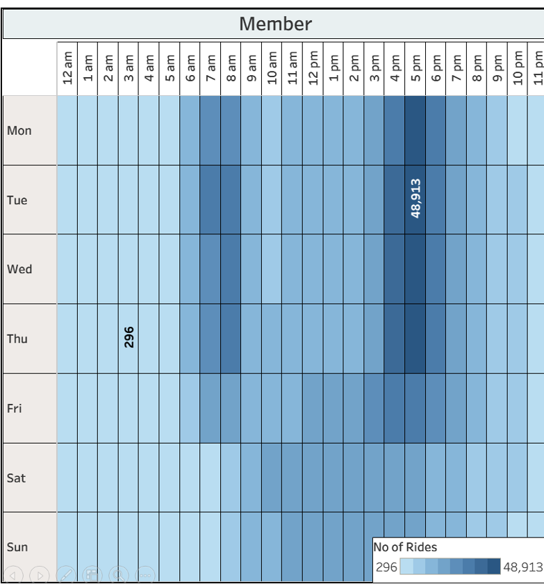
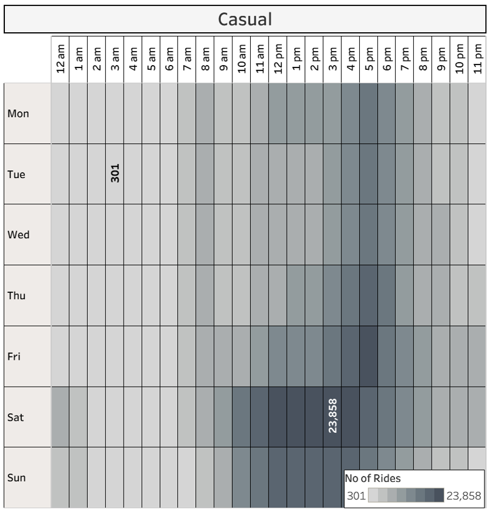

Google Data Analytics · Capstone Project

# Cyclistic 2025 Case Study: Analyzing User Behavior to Drive Annual Membership Growth

📅 **Dataset: Jan – Dec 2025**
🚲 **3,661,396 Rides Analysed**
🛠 **DBeaver · Power BI · Tableau**

### Abstract

This case study analyses a full year of Cyclistic bike-share trip data from January to December 2025 to answer a core business question: *How do annual members and casual riders use Cyclistic bikes differently?* Using SQL for data processing and Power BI and Tableau for visualisation, the analysis examines over 3.66 million rides across dimensions of time, duration, route type, and geography. Key findings reveal that annual members use the service as a reliable daily commuting tool, while casual riders engage primarily for weekend leisure and tourism. Based on these findings, seven targeted marketing recommendations supported by 17 data visualizations are proposed to drive casual-to-member conversion.

## Table of Contents

* [1. Introduction](#intro)
* [2. Ask — Business Task](#ask)
* [3. Prepare — Data Sources](#prepare)
* [4. Process — Data Cleaning](#process)
* [5. Analyze & Share](#analyze)
* [6. Act — Recommendations](#act)

<a id="intro"></a>
### Section 01
## Introduction 

Cyclistic is a Chicago-based bike-share program operating a fleet of over 5,800 geotracked bicycles across 692 docking stations. While the majority of users ride for leisure, around 30% rely on Cyclistic for their daily commute.

Cyclistic's pricing model offers three options: single-ride passes, full-day passes, and annual memberships. Riders who purchase single-ride or day passes are classified as **casual riders**, while those who purchase annual memberships are **Cyclistic members**. The company's finance team has determined that annual members are substantially more profitable than casual riders.

Cyclistic's Director of Marketing, has identified a clear strategic opportunity: rather than targeting entirely new customers, the company should focus on converting its existing casual rider base into annual members. Casual riders are already familiar with the service and have demonstrated a willingness to pay for it. The challenge is understanding what drives the two groups' different usage patterns — and using those insights to craft compelling conversion strategies.

As a junior data analyst on the marketing team, this study addresses the first of three guiding questions assigned by Moreno: **How do annual members and casual riders use Cyclistic bikes differently?**
<a id="ask"></a>
### Section 02 - Ask

## Business Task

Step 2 of 6: Ask

The overarching goal of the marketing team is to **design strategies that convert casual riders into annual members**. Three questions guide the broader programme:

* How do annual members and casual riders use Cyclistic bikes differently?
* Why would casual riders buy a Cyclistic annual membership?
* How can Cyclistic use digital media to influence casual riders to become members?

This study focuses on the **first question**. The key deliverable is a data-supported characterisation of the behavioural differences between the two rider groups — providing the evidential foundation upon which conversion strategies can be built.

<a id="prepare"></a>
### Section 03 — Prepare

## Data Sources & Structure

Step 3 of 6: Prepare

The dataset used is Cyclistic's publicly available historical trip data for the full year 2025, published by Motivate International Inc. under an open data licence. The data comprises **twelve monthly CSV files**, each following the naming convention `YYYYMM-divvy-tripdata`. Together, they contain a combined 5,601,662 raw rows covering every recorded trip taken during the year. The corresponding column names are:
- ride_id
- rideable_type
- started_at
- ended_at
- start_station_name
- start_station_id
- end_station_name
- end_station_id
- start_lat
- start_lng
- end_lat
- end_lng
- member_casual


### Data Credibility (ROCCC Assessment)

The dataset is assessed against the ROCCC framework:

| Criterion | Assessment |
| --- | --- |
| **Reliable** | Data is collected automatically via geotracked docking hardware — not self-reported |
| **Original** | First-party data sourced directly from Motivate International Inc., the operator of Divvy |
| **Comprehensive** | Covers all trips across all stations for a full calendar year (12 months) |
| **Current** | 2025 data is fully current and directly relevant to present business decisions |
| **Cited** | Publicly available under the Motivate International Inc. open data licence |

**Privacy note:** The dataset contains no personally identifiable information. It is therefore not possible to link individual rides to specific users or determine whether a casual rider has purchased multiple passes — a limitation acknowledged in the analysis.
<a id="process"></a>
### Section 04 — Process

## Data Processing & Cleaning

Step 4 of 6: Process

**Tool used:** DBeaver SQLite — chosen for its ability to handle multi-million-row datasets efficiently and document the cleaning process transparently through SQL queries.

### Step 1 — Data Combination

The twelve monthly CSV files were first imported individually into DBeaver as separate tables. A `UNION ALL` query was then executed to merge all twelve tables into a single annual dataset named **annual\_trips\_2025**, yielding a total of 5,601,662 rows.

SQL — Data Combination

```
CREATE TABLE annual_trips_2025 AS
  SELECT * FROM "202501_divvy_tripdata"
  UNION ALL
  SELECT * FROM "202502_divvy_tripdata"
  UNION ALL
  SELECT * FROM "202503_divvy_tripdata"
  UNION ALL
  SELECT * FROM "202504_divvy_tripdata"
  UNION ALL
  SELECT * FROM "202505_divvy_tripdata"
  UNION ALL
  SELECT * FROM "202506_divvy_tripdata"
  UNION ALL
  SELECT * FROM "202507_divvy_tripdata"
  UNION ALL
  SELECT * FROM "202508_divvy_tripdata"
  UNION ALL
  SELECT * FROM "202509_divvy_tripdata"
  UNION ALL
  SELECT * FROM "202510_divvy_tripdata"
  UNION ALL
  SELECT * FROM "202511_divvy_tripdata"
  UNION ALL
  SELECT * FROM "202512_divvy_tripdata";

```
<br>


<p align="center"> 
 Screenshot 1: Importing the 12 CSV files.
<br>


<p align="center"> 
Screenshot 2: Executing the UNION ALL query in DBeaver to merge 12 months of data.
<br>


<p align="center"> 
Screenshot 3: The resulting table 'annual_trips_2025'
<br>

### Step 2 — Data Exploration

To check the total no of rows in the new compiled table, the following SQL query is executed. The new dataset <b>annual_trips_2025</b> holds a total of **5,601,662** data rows encompassing the entire year:

```
SELECT COUNT(*) FROM annual_trips_2025 t ;
```
The following code is executed to show the first 10 rows of the dataset in order to understand the dataset better..

```
SELECT * FROM "annual_trips_2025"
LIMIT 10;
```


Screenshot 4: First ten rows of the new combined table

The following query is performed to get an idea about the no of values present:
```
SELECT COUNT(ride_id)
FROM annual_trips_2025
```


Screenshot 5: Count of ride ids


A total of 5.6 million values is observed.

It can be checked if there are any ***null*** values in any of the columns of the dataset by executing the following query:

```
SELECT 
	COUNT(*) - COUNT(ride_id) AS ride_id_null,
	COUNT(*) - COUNT(rideable_type) AS rideable_type_null,
	COUNT(*) - COUNT(started_at) AS started_at_null,
	COUNT(*) - COUNT(ended_at) AS ended_at_null,
	COUNT(*) - COUNT(start_station_name) AS start_station_name_null,
	COUNT(*) - COUNT(start_station_id) AS start_station_id_null,
	COUNT(*) - COUNT(end_station_name) AS end_station_name_null,
	COUNT(*) - COUNT(end_station_id) AS end_station_id_null,
	COUNT(*) - COUNT(start_lat) AS start_lat_null,
	COUNT(*) - COUNT(start_lng) AS start_lng_null,
	COUNT(*) - COUNT(end_lng) AS end_lng_null,
	COUNT(*) - COUNT(member_casual) AS member_casual_null
FROM annual_trips_2025
```


### It can be seen from the screenshot that there are no **null** values.

It might happen that there might be no null values but there might be missing values or ones that contain empty strings or empty spaces like " " this. To find them out the following query is performed:

```
SELECT 
    SUM(CASE WHEN ride_id IS NULL OR ride_id = '' THEN 1 ELSE 0 END) AS missing_ride_id,
    SUM(CASE WHEN rideable_type IS NULL OR rideable_type = '' THEN 1 ELSE 0 END) AS missing_rideable_type,
    SUM(CASE WHEN started_at IS NULL OR started_at = '' THEN 1 ELSE 0 END) AS missing_started_at,
    SUM(CASE WHEN ended_at IS NULL OR ended_at = '' THEN 1 ELSE 0 END) AS missing_ended_at,
    SUM(CASE WHEN start_station_name IS NULL OR start_station_name = '' THEN 1 ELSE 0 END) AS missing_start_station_name,
    SUM(CASE WHEN start_station_id IS NULL OR start_station_id = '' THEN 1 ELSE 0 END) AS missing_start_station_id,
    SUM(CASE WHEN end_station_name IS NULL OR end_station_name = '' THEN 1 ELSE 0 END) AS missing_end_station_name,
    SUM(CASE WHEN end_station_id IS NULL OR end_station_id = '' THEN 1 ELSE 0 END) AS missing_end_station_id,
    SUM(CASE WHEN start_lat IS NULL OR start_lat = '' THEN 1 ELSE 0 END) AS missing_start_lat,
    SUM(CASE WHEN start_lng IS NULL OR start_lng = '' THEN 1 ELSE 0 END) AS missing_start_lng,
    SUM(CASE WHEN end_lat IS NULL OR end_lat = '' THEN 1 ELSE 0 END) AS missing_end_lat,
    SUM(CASE WHEN end_lng IS NULL OR end_lng = '' THEN 1 ELSE 0 END) AS missing_end_lng,
    SUM(CASE WHEN member_casual IS NULL OR member_casual = '' THEN 1 ELSE 0 END) AS missing_member_casual
FROM annual_trips_2025;
```


### It can be seen from the screenshot that number of such missing values or empty space value exist.
Now it is necessary to check if there are any duplicate values which might skew the results. This is done by checking duplicates for any values in the ride_id column since this is the primary key. 

```
SELECT 
	COUNT(ride_id) - COUNT(DISTINCT ride_id) AS ride_id_dupl
FROM annual_trips_2025

```


### It can be seen from the screenshot that there are no **duplicate** values.

Typically, rides should not be less than 60 seconds or more than a day or 24 hours(86400 seconds). Rides recorded with such values indicate mistakes in recording or docking/undocking of the bike. Also, end time of ride can not be before start time of ride. Following query is performed to view if any such abnormal rides are recorded:
```
SELECT 
    SUM(CASE WHEN (strftime('%s', ended_at) - strftime('%s', started_at)) > 86400 THEN 1 ELSE 0 END) AS long_rides,
    SUM(CASE WHEN (strftime('%s', ended_at) - strftime('%s', started_at)) < 60 THEN 1 ELSE 0 END) AS short_ride,
    SUM(CASE WHEN ended_at < started_at THEN 1 ELSE 0 END) AS neg_rides
FROM annual_trips_2025;
```


### It can be seen from the screenshot that there are number of such abnormal values.
<br>

<em> 
Prior to cleaning, the following findings were there across four dimensions:</em>

| Check Performed | Findings |
| --- | --- |
| Null values in all columns | No null values detected in any column |
| Empty strings / blank values | Empty values present in station name and station ID columns |
| Duplicate ride IDs | No duplicate records detected |
| Abnormal ride durations | Rides under 60 seconds, over 24 hours, and with negative duration (ended\_at < started\_at) were identified |


### Step 3 — Data Cleaning & Feature Engineering

The trip starts and end times are indicated in the format YYYY-MM-DD hh:mm:ss UTC in the columns *"started_at"* and *"ended_at."* By introducing a new column called ***"ride_length"*** the total trip duration for each ride can be viewed. 

To ensure the integrity of the analysis, trips lasting less than one minute or exceeding 24 hours were removed(negative values where the end time is before the starting time are automatically nullified by the condition when trip duration is more than positive 60 seconds). These records often represent docking errors or maintenance tasks rather than valid customer journeys. 

There are no null values but there are missing values for multiple columns which are also removed. 

Following query is performed to create a new table "annual_trips_2025_cleaned" devoid of all null, missing and wrong values:

```
CREATE TABLE annual_trips_2025_cleaned AS
SELECT 
    *,
    -- Calculates ride length in HH:MM:SS
    time(strftime('%s', ended_at) - strftime('%s', started_at), 'unixepoch') AS ride_length,
    -- Adds the day of the week name
    CASE strftime('%w', started_at)
      WHEN '0' THEN 'Sun' WHEN '1' THEN 'Mon' WHEN '2' THEN 'Tue' WHEN '3' THEN 'Wed'
      WHEN '4' THEN 'Thu' WHEN '5' THEN 'Fri'WHEN '6' THEN 'Sat'
    END AS day_of_week,
    -- Adds the day of the week no
    (strftime('%w', started_at) + 1) AS day_of_week_no,
    -- Month Calculation
    CASE strftime('%m', started_at)
    	WHEN '01' THEN 'Jan' WHEN '02' THEN 'Feb' WHEN '03' THEN 'Mar'
        WHEN '04' THEN 'Apr' WHEN '05' THEN 'May' WHEN '06' THEN 'Jun'
        WHEN '07' THEN 'Jul' WHEN '08' THEN 'Aug' WHEN '09' THEN 'Sep'
        WHEN '10' THEN 'Oct' WHEN '11' THEN 'Nov' WHEN '12' THEN 'Dec'
    END AS month    
FROM annual_trips_2025
-- Filters for data quality
WHERE 
    (strftime('%s', ended_at) - strftime('%s', started_at)) > 60 
    AND (strftime('%s', ended_at) - strftime('%s', started_at)) < 86400
    AND start_station_name IS NOT NULL AND TRIM(start_station_name) != ''
    AND end_station_name IS NOT NULL AND TRIM(end_station_name) != ''
    AND end_lat IS NOT NULL 
    AND end_lng IS NOT NULL;
```
    

### It can be seen from the screenshot that the no of new rows is ***3,661,396***. So, 5,601,662 − 3,661,396 = ***1,940,266*** erroneous values were removed.

Now following query is performed to create a table with most relevant parameters for better ease of analyzing the data:
```
CREATE TABLE compact_trips AS
SELECT ride_id, rideable_type, start_station_name, end_station_name, member_casual, day_of_week, month
FROM annual_trips_2025_cleaned atc 
```


The number of trips taken by each type of bike can be viewed by the following query:

```
SELECT DISTINCT rideable_type,
	COUNT(*) AS trip_count
FROM compact_trips ct 
GROUP BY rideable_type;
```


The number of trips taken by each type of rider can be viewed by the following query:

```
SELECT DISTINCT member_casual,
	COUNT(*) AS rider_type
FROM compact_trips ct
GROUP BY member_casual;
```


The new table **annual\_trips\_2025\_cleaned**, was created applying the following transformations and filters simultaneously:

* Calculated **ride\_length** in HH:MM:SS format from the difference between `ended_at` and `started_at`
* Extracted **day\_of\_week** (Sun–Sat) and numeric **day\_of\_week\_no** (1–7) from the start timestamp
* Extracted **month** (Jan–Dec) from the start timestamp
* Removed rides under 60 seconds — likely docking errors or test rides
* Removed rides over 86,400 seconds (24 hours) — likely maintenance or unreturned bikes
* Removed rows where `start_station_name` or `end_station_name` were null or empty
* Removed rows where `end_lat` or `end_lng` were null
* 5.60M Raw Rows (Combined)
* 3.66M Rows After Cleaning
* 1.94M Rows Removed
* 34.6% Data Removed

The substantial removal rate of 34.6% is primarily driven by missing station names — a known characteristic of electric bike rides that are sometimes locked to street-level infrastructure rather than formal docking stations. The retained 3,661,396 rows represent all valid, station-docked trips suitable for behavioural analysis.
<a id="analyze"></a>
###Section 05 — Analyze & Share

## Data Analysis & Visualisation

Steps 5 & 6 of 6: Analyze & Share

The cleaned dataset was connected to both Power BI and Tableau Public for visualisation. The analysis is structured around six thematic areas, progressively building a complete behavioural profile of each rider group. The central question throughout is: *how do members and casual riders use Cyclistic differently?*

### 5.1  Rider Composition & Bike Type Preference

The first step is to establish who is using Cyclistic and which bike types each group gravitates toward.


**Figure 1.** Overall member vs. casual rider split (left) and Breakdown of rides by bike type and rider category (right).

Of the 3,661,396 total cleaned rides in 2025, annual members account for 2,350,000 rides (64.22%) and casual riders account for 1,310,000 rides (35.78%). Members are the clear majority user group. Regarding bike preferences:

* **Annual members** dominate ride volume (64.22%), but the **casual** segment — at 1.31M rides — also represents a substantial and engaged user base.
* **Classic bikes** are the most popular overall — members logged ~1.27M classic rides (34.8% of all rides), casuals ~0.67M (18.2%)
* **Electric bikes** rank second — members ~1.08M (29.4%), casuals ~0.64M (17.5%)
* The near-equal bike-type distribution among casual riders, compared to the member preference for classic bikes, suggests casual riders prioritize flexibility over routine


### 5.2  Trip Patterns Over Time

Analysing when each group rides — across months, days of the week, and hours of the day — reveals the most fundamental behavioural distinction between the two groups.

#### Monthly Trends


**Figure 2.** Total rides by month for annual members and casual riders.


This monthly analysis reveals that Members are "All-Weather Commuters" while Casuals are "Fair-Weather Explorers." Members maintain a steady floor (83k+ rides) even in the dead of winter. Casual ridership is acutely seasonal, collapsing to near-zero in winter while member volume sustains meaningful year-round activity. This seasonal gap is not merely a usage pattern — it is a value proposition waiting to be articulated: membership is what keeps riders riding when the weather no longer invites it.

#### Weekly Trends


**Figure 3.** Total rides per day of the week for annual members and casual riders.

The weekly pattern is the single clearest indicator of different use cases. **Members peak on Tuesday through Thursday**, with each weekday recording approximately 346,000–381,000 rides, and drop significantly on weekends (Sunday: ~249,000). **Casual riders show the exact opposite** — peaking on Saturday (273,000 rides) and remaining elevated on Sunday, while weekday usage is considerably lower (Monday: ~142,000). This reversal is the defining signature of the commuter vs. leisure divide.

#### Hourly Trends

.png>)

**Figure 4.** Total rides by hour of the day for annual members and casual riders.

The hourly breakdown confirms the commuting hypothesis for members. **Members display two sharp rush-hour peaks** — one around 8 AM and a larger one around 5 PM (hour 17), the classic double-peak of a working commuter. **Casual riders display a single, gradual peak** — volume builds throughout the morning, reaches a plateau between 3–6 PM, and declines. There is no discernible morning rush for casual riders, which is inconsistent with commute behaviour and consistent with leisure.

### 5.3  Ride Density by Day & Hour

To capture the combined effect of both day-of-week and hour-of-day simultaneously, a density heatmap is used. This provides the richest single-chart summary of behavioural difference between the two groups.



**Figure 5.** Ride density heatmap — rides per hour per day for members.



**Figure 6.** Ride density heatmap — rides per hour per day for casual riders.

The contrast between the two panels is immediately striking:

##### Members

Two vertical bands dominate: **7–9 AM** and **4–6 PM on weekdays**. Peak cell: **Tuesday 5 PM — 48,913 rides**. Minimum: Thursday 3 AM — 296 rides. Weekend activity exists but is muted and spread across midday without sharp peaks.

##### Casual Riders

Activity concentrates in a wide block spanning **Saturday and Sunday afternoons (12 PM–7 PM)**. Peak cell: **Saturday 5 PM — 23,858 rides**. Minimum: Tuesday 3 AM — 301 rides. Weekday usage is moderate and spread without commute-style spikes.

### 5.4  Average Ride Duration

Ride frequency tells us *when* each group rides. Duration tells us *how they ride* — the character of their journeys.

#### Monthly Duration Trends

.png>)

**Figure 7.** Average ride duration (minutes) per month for casual riders and annual members.

**Casual riders** show substantial seasonal variation — average trip length rises to approximately 24–25 minutes in the peak summer months (May–August) and falls to 13–14 minutes in December and January. **Members** display remarkable consistency, hovering between 10–13 minutes across all twelve months regardless of season. This member consistency, even as their total volume drops in winter, confirms that members are making the same kinds of purposeful trips year-round.

#### Weekly Duration Trends


**Figure 8.** Average ride duration (minutes) per day of the week for casual riders and annual members.

Casual riders ride longest on **Sundays (26 min)** and **Saturdays (25 min)**, tapering to approximately 20 minutes on weekdays. This elongation on leisure days is consistent with relaxed sightseeing or exploratory cycling. Members show a flat profile of **12–14 minutes every day of the week**, with minimal variance — the hallmark of fixed-route, habitual commuting.
#### Hourly Duration Trends


**Figure 9.** Overall average ride duration for casual riders and annual members across all of 2025.

Casual riders average 22 minutes per ride. Members average 12 minutes. Casual riders spend 83% longer on the bike per trip — taking fewer but fundamentally different kinds of journeys.

### 5.5 Route & Geographic Analysis

## Section A — Geographic Distribution: Where Riders Start and End


**Figure 10.** Number of trips at starting points(Member)


**Figure 11.** Number of trips at end points(Member)


**Annual members** have some dominant stations — Ellis Ave & 55th St, Ellis Ave & 60th St, University Ave & 57th St, LaSalle St & Jackson Blvd, Ravenswood Ave, and Halsted St & Clybourn — which map onto office corridors, transit interchanges, and university campuses, most notably the University of Chicago. These are functional commuter nodes, not leisure destinations.


**Figure 12.** Number of trips at start points(Casual)


**Figure 13.** Number of trips at end points(Casual)

**Casual riders** cluster exclusively along Chicago's northeastern recreational belt. Their top origin and destination stations — DuSable Lake Shore Dr & Monroe St, Navy Pier, Millennium Park, Streeter Dr & Grand Ave, Shedd Aquarium, Adler Planetarium, Field Museum, and Buckingham Fountain — form a coherent arc along the lakefront and Museum Campus. These are not transit nodes. They are tourist and leisure destinations. 

> *The station geography confirms that casual riders and annual members are not simply the same population making different trip choices — they are structurally different user groups with different spatial relationships to the city. Any conversion strategy must bridge not just a pricing gap but a geographic and motivational one.*

---

## Section B — Journey Type: One-Way vs. Round Trips


**Figure 14.** Route type used ratio


The round-trip analysis adds a behavioural dimension that station geography alone cannot capture.

Casual riders complete round trips at a rate of approximately **8.4%** — four times higher than the member rate of **2.1%**. On the surface this seems like a small number, but in the context of 1.31M casual rides, it represents over 110,000 round-trip journeys annually. These are riders who unlock a bike, ride out, and return to exactly the same station — the defining behaviour of a leisure excursion, not a commute.

The member round-trip rate of 2.1% is consistent with occasional errand-running or recreational use within an otherwise commuter-dominated profile. For members, the round trip is the exception. For a meaningful subset of casual riders, it is the pattern.

This matters for conversion strategy: a casual rider who repeatedly completes round trips from Navy Pier or Millennium Park is demonstrating **habitual Cyclistic engagement** in a leisure context. They are not an irregular user — they are a regular user with a different use case. The membership offer needs to speak to that use case directly, not assume they will adopt a commuter frame.

---

## Section C — The Sankey Diagrams: Route Flow by Member Type


**Figure 15.** Top routes by ride count and member type

This figure shows the full picture: both casual and member flows side by side. The flows fanning out to the right reveal that casual trips terminate at a **wider, more dispersed set of destinations**, while member flows converge more tightly on a smaller cluster of endpoints.


**Figure 16.** Top routes by ride count and casual riders

This chart isolates casual rider flow and makes the leisure circuit unmistakable. The dominant flows originate from DuSable Lake Shore Dr & Monroe St and DuSable Harbor, and terminate at Navy Pier, Streeter Dr & Grand Ave, and back to DuSable Lake Shore Dr & Monroe St itself. The flows are broad, curving, and multi-directional — visually representing the exploratory, non-linear character of casual journeys.


**Figure 17.** Specific route by ride count and member type

This chart surfaces a particularly telling data point: the route **Ellis Ave & 60th St → University Ave & 57th St**, taken 768 times by casual riders. These 768 casual rides on a commuter-pattern route represent exactly the conversion-ready population the marketing team should target: riders already behaving like members, but paying casual prices. 

---

## Section D — Synthesis: What Routes and Geography Tell Us Together

Combining all four visual layers — start station maps, end station maps, one-way/round-trip pie charts and the three Sankey diagrams — four conclusions emerge that are directly actionable for the conversion strategy:

**1. Two geographically distinct user populations**
Casual riders occupy the lakefront leisure belt; members occupy the campus and office corridor. Conversion campaigns must be geographically targeted, not city-wide.

**2. The lakefront stations are the highest-leverage physical touchpoints**
DuSable Lake Shore Dr, Navy Pier, Millennium Park, and Streeter Dr & Grand Ave appear consistently as the dominant casual origin and destination nodes across every chart. These five locations should be the primary sites for on-station membership marketing.

**3. Round-trip riders are behaviorally habitual — and reachable**
The 8.4% round-trip rate among casuals, mapped against the station geography, localises repeat leisure riders to the lakefront cluster. These are not one-time visitors — they are recurring users whose behaviour already resembles membership-level engagement, without the membership.

**4. The Ellis Ave corridor reveals a hidden conversion pocket**
The Sankey tooltip (Figure 17) identifies 768 casual rides on the Ellis Ave & 60th St → University Ave & 57th St route — a commuter-pattern journey in a member-dominated zone. 


### 5.6 Summary of Findings

The findings are summarised below:

| Dimension | Casual Riders | Annual Members |
| --- | --- | --- |
| **Share of total rides** | 35.78% (1.31M) | 64.22% (2.35M) |
| **Bike preference** | Classic & Electric (near equal) | Classic (slight preference) |
| **Peak day** | Saturday | Tuesday – Thursday |
| **Peak hour** | 4 PM (single broad peak) | 8 AM and 5 PM (double commute peak) |
| **Peak season** | May – August | June – September (year-round) |
| **Avg. ride duration** | ~22 minutes | ~12 minutes |
| **Duration variability** | High — peaks in summer & weekends | Low — consistent year-round |
| **Round trip rate** | ~8.4% | ~2.1% |
| **Top start/end locations** | Parks, piers, museums, lakefront | Offices, transit hubs, universities |
| **Usage pattern** | Leisure / recreational / tourism | Commuting / purposeful / habitual |
| **Weather sensitivity** | High — sharp winter collapse | Moderate — sustained year-round |

The **central finding** of this analysis can be stated plainly: annual members use Cyclistic as a reliable daily commuting tool — taking short, efficient, weekday rides between homes, offices, and universities, year-round. Casual riders use it as a leisure vehicle — taking longer, exploratory, weekend rides near iconic Chicago attractions, primarily across the summer months. These are not two points on a spectrum. They are two distinct use cases, and any conversion strategy must bridge not just a pricing gap, but a geographic, temporal, and motivational one.


---
<a id="act"></a>
### Section 06 — Act
## Recommendations

Based on the full analysis, the following seven recommendations are proposed to Cyclistic's marketing team. Each is anchored directly to a specific finding and targets a distinct conversion opportunity.

---

#### Recommendation 1 — Deploy On-Site Conversion Campaigns at Lakefront Hotspot Stations

The geographic analysis identifies a small cluster of high-traffic casual stations — DuSable Lake Shore Dr & Monroe St, Navy Pier, Millennium Park, and Streeter Dr & Grand Ave — that collectively account for a disproportionate share of casual trip origins and destinations, confirmed across the station maps, the top routes table, and all three Sankey diagrams. These stations are the highest-leverage physical touchpoints in the entire network for casual-to-member conversion.

Digital screens, QR-code posters, and on-bike messaging at these locations should actively promote annual membership. The messaging should not be framed around commuting — it should speak the casual rider's language: cost savings on the rides they already take, at the places they already love. Since these riders already choose Cyclistic, the barrier is not discovery but commitment.

> **Data anchor:** Casual station geography (Figures 12–13); Sankey diagrams (Figures 15–17); 

---

#### Recommendation 2 — Launch a Weekend Annual Membership Tier

The weekly analysis shows that casual riders peak sharply on Saturday (272,520 rides) and remain elevated on Sunday (221,341) — their two highest days of the week and the two lowest for members. The full annual membership, priced and marketed around daily commuting utility, may not feel relevant to a rider who only ever cycles on weekends.

A **Weekend Annual Pass** — valid on Saturdays, Sundays, and public holidays at a reduced annual price — lowers both the financial and psychological commitment barrier by matching the product to the casual rider's actual usage pattern. Riders who enter the membership ecosystem through a weekend pass can subsequently be upsold to full membership via in-app personalised messaging as their usage evolves.

Weekend rides are also the longest casual rides of the week (25–26 minutes on Sat/Sun), meaning weekend members would receive the greatest financial benefit per ride relative to day-pass pricing — making the value proposition most compelling precisely for the riders this tier targets.

> **Data anchor:** Weekly ride trends (Figure 3); Weekly duration trends (Figure 8).

---

#### Recommendation 3 — Run a Time-Limited Summer Conversion Campaign (May–August)

Casual ridership surges from 76,323 in April to 124,470 in May and peaks at 219,120 in August — a nearly 3× increase in four months. This is the window of maximum casual engagement, maximum brand exposure, and maximum habit formation.

A time-limited offer — a discounted first-year membership, a complimentary first month, or a *"lock in summer rates"* promotion — should be deployed exclusively during this window. Push notifications through the Cyclistic app targeting users who have completed three or more casual rides in the preceding 30 days should be triggered in **late April**, before the surge begins, to intercept riders at the moment they are about to increase frequency.

The monthly duration data adds further precision: May–August is also when casual ride duration peaks at 23–25 minutes, meaning the per-ride cost saving argument is at its most compelling in exactly the same window.

> **Data anchor:** Monthly ride trends (Figure 2); Monthly duration trends (Figure 7).

---

#### Recommendation 4 — Deliver Personalised Cost-Comparison Nudges After Long Rides

Casual riders average 22 minutes per ride overall, rising to 25–26 minutes on weekends and 28 minutes at the 10 AM leisure peak — nearly double the member average of 12 minutes. Under day-pass pricing, longer rides cost casual riders proportionally more without any additional benefit.

Immediately after a casual rider completes a ride exceeding 15 minutes, a push notification should deliver a personalised, ride-specific cost comparison: *"Your ride today was 24 minutes. As an annual member, you would have saved $X on this ride alone."* This converts an abstract membership benefit into a concrete, personal financial statement tied to a journey the rider just experienced — a far more persuasive trigger than generic advertising.

> **Data anchor:** Hourly duration trends (Figure 9); Weekly duration trends (Figure 8); Monthly duration trends (Figure 7).

---

#### Recommendation 5 — Target Repeat Round-Trip Riders with Automated Behaviour-Triggered Messaging

Casual riders complete round trips at a rate of **8.4%** — four times the member rate of 2.1% — representing over 110,000 round-trip journeys annually. A rider who repeatedly returns to the same station is demonstrating habitual Cyclistic engagement in a leisure context.

This behavioural signal should trigger an automated in-app notification after two or more round trips from the same station within a 30-day window:

*"You've started and ended at Navy Pier three times this month — an annual membership would have saved you £X on these rides."*

This is the most precisely targeted conversion trigger in the toolkit: it speaks to what the rider has actually done, at the station they demonstrably prefer, with a savings figure calculated from their own ride history. Blanket advertising cannot replicate this level of personalisation.

> **Data anchor:** Route type pie chart (Figure 14); Casual station geography (Figures 12–13).

---

#### Recommendation 6 — Partner with the University of Chicago for Targeted Membership Acquisition

The Sankey diagram (Figure 17) identifies **768 casual rides** on the Ellis Ave & 60th St → University Ave & 57th St route — a short inter-campus journey in the heart of the University of Chicago corridor, which is otherwise the most member-dominated zone in the network. These casual riders are already behaving like members on a commuter-pattern route, but paying casual prices.

Combined with the station geography showing Ellis Ave and University Ave as top member origin and destination points, this corridor presents a concentrated, high-probability conversion pocket. A formal partnership offering discounted annual memberships to enrolled students and university employees would capture a price-sensitive, mobility-dependent audience already proven to use Cyclistic for campus commuting — and would convert the casual riders currently making these commuter-pattern trips without a membership.

> **Data anchor:** Sankey specific route (Figure 17); Member station geography (Figures 10–11).

---

#### Recommendation 7 — Market Electric Bike Priority Access as a Premium Membership Benefit

Casual riders use electric bikes at nearly the same rate as classic bikes (17.5% vs. 18.2% of all rides) — a near-equal split that contrasts with the member preference for classic bikes. This signals strong casual appetite for electric options, consistent with the character of casual journeys: longer, more effortful, and experiential.

Cyclistic should ensure high electric bike availability at the top casual origin stations (Navy Pier, Millennium Park, DuSable Lake Shore Dr) and frame annual membership as the gateway to **priority electric bike access** — guaranteed e-bike availability or discounted electric ride rates for members. This reframes the membership value proposition beyond cost savings alone, positioning it as access to a premium, modern cycling experience that casual riders already enjoy and would want to secure.

For a rider already predisposed to electric bikes and taking 22–26 minute leisure rides, priority e-bike access is a tangible, aspirational benefit that a standard price-comparison message cannot match.

> **Data anchor:** Bike type breakdown (Figure 1); Casual station geography (Figures 11–12); Duration trends (Figures 7–9).

---

*This report was prepared as part of the Google Data Analytics Professional Certificate Capstone Project.*


##### Dataset: Divvy Tripdata 2025 · Published by Motivate International Inc. · Data processing: DBeaver / SQLite · Visualisations: Power BI & Tableau Public
