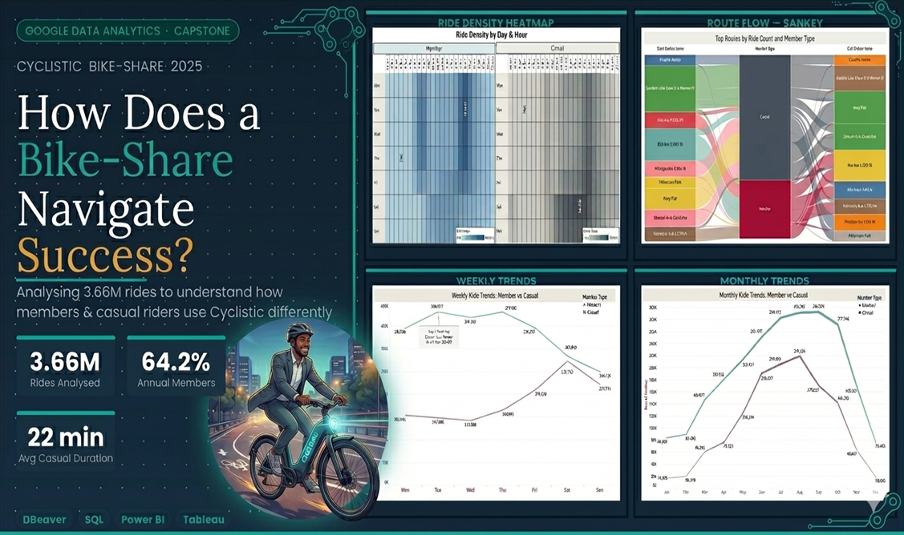

  

 

# 🚲 Cyclistic Bike-Share: How Does a Bike-Share Navigate Speedy Success?

**Google Data Analytics Professional Certificate — Capstone Case Study**

 

---

## ⚡ TL;DR — What I Found in 3 Lines

> **Members commute. Casuals explore.** Members show a double rush-hour peak (8 AM & 5 PM on weekdays). Casual riders peak on Saturday afternoons with no morning spike.

> **Casual riders spend 83% longer per ride** (22 min avg vs. 12 min) — but their trips are round-trips at tourist landmarks, not purposeful commutes.

> **One Sankey diagram revealed a hidden conversion pocket** — 768 casual rides on the #1 member commute route (Ellis Ave corridor), invisible in any aggregate chart.

---

## 📋 Table of Contents

| | Section |
|---|---|
| [🎯](#-business-problem) | Business Problem |
| [📦](#-dataset) | Dataset |
| [🔄](#-analysis-process) | Analysis Process (6 Steps) |
| [📊](#-key-visualisations--insights) | Key Visualisations & Insights |
| [💡](#-top-7-recommendations) | Top 7 Recommendations |
| [👤](#-about-me) | About Me |

---

## 🎯 Business Problem

Cyclistic is a Chicago-based bike-share company. Its finance team identified that **annual members are significantly more profitable** than casual riders. Rather than targeting new customers, the Director of Marketing wants to **convert the existing casual rider base into members**.

**My task:** Analyse 12 months of 2025 trip data and answer:
> *How do annual members and casual riders use Cyclistic bikes differently?*

| Metric | Value |
|--------|-------|
| 📅 Data Period | January – December 2025 |
| 🚲 Total Rides Analysed | **3,661,396** |
| 👥 Annual Members | **2.35M (64.22%)** |
| 🎫 Casual Riders | **1.31M (35.78%)** |

---

## 📦 Dataset

- **Source:** [Divvy Trip Data](https://divvy-tripdata.s3.amazonaws.com/index.html) — published by Motivate International Inc.
- **Licence:** [Open Data Licence](https://divvybikes.com/data-license-agreement)
- **Format:** 12 monthly CSV files (`YYYYMM-divvy-tripdata`)
- **Raw rows:** 5,601,662 → **3,661,396 after cleaning (34.6% removed)**
- **Privacy:** No personally identifiable information. Rider-level tracking is not possible.

---

## 🔄 Analysis Process

Following the **Google Data Analysis Framework** — all six phases applied end-to-end:

| Step | Phase | What I Did |
|------|-------|------------|
| 1️⃣ | **Ask** | Defined the business task and key questions |
| 2️⃣ | **Prepare** | Sourced, assessed credibility (ROCCC), and organised 12 CSV files |
| 3️⃣ | **Process** | Combined 12 files via `UNION ALL` in DBeaver; cleaned nulls, blanks, abnormal durations; engineered `ride_length`, `day_of_week`, `month` columns |
| 4️⃣ | **Analyse** | Queried patterns across time, duration, route type, and geography |
| 5️⃣ | **Share** | Built 16 visualisations in Power BI and Tableau across 6 analytical themes |
| 6️⃣ | **Act** | Produced 7 data-backed marketing recommendations |

📄 **Full documentation with all SQL queries:** [A Cyclistic_Case_Study.md](https://github.com/saadat215/Google-Data-Analytics-Capstone-Cyclistic/blob/main/A%20Cyclistic_Case_Study.md)

---

## 📊 Key Visualisations & Insights

### 1 — Rider Composition & Bike Type

 

- Members: **2.35M rides (64.22%)** | Casual: **1.31M rides (35.78%)**
- Casual riders split almost equally between classic (18.2%) and electric (17.5%) — unlike members who lean classic

---

### 2 — When Do They Ride? Time Patterns

| | Members | Casual Riders |
|--|---------|---------------|
| **Peak Month** | September (292,832 rides) | August (219,120 rides) |
| **Winter Low** | January (83,654 rides) | January (16,946 rides) |
| **Seasonal Swing** | 3.5× | **~13×** |

> **Insight:** Members ride year-round. Casual riders almost disappear in winter — they're weather-dependent leisure users.

 

> **Insight:** Members peak Tuesday–Thursday (commute days). Casual riders peak Saturday–Sunday (leisure days). Exact opposites.

---

### 3 — The Heatmap: One Chart That Says Everything

| | Members | Casual Riders |
|--|---------|---------------|
| **Pattern** | Two dark bands: 7–9 AM & 4–6 PM weekdays | Broad Saturday–Sunday afternoon block |
| **Peak Cell** | Tuesday 5 PM — **48,913 rides** | Saturday 5 PM — **23,858 rides** |
| **Min Cell** | Thursday 3 AM — 296 rides | Tuesday 3 AM — 301 rides |

> **Insight:** Members = commuters. Casuals = weekend leisure riders. The heatmap makes this impossible to misread.

---

### 4 — Average Ride Duration

- **Casual riders average 22 minutes per ride. Members average 12 minutes** — an 83% difference.
- Casual duration peaks at **10 AM (28 min)** — mid-morning leisurely exploration
- Member duration is flat at **11–13 min across all 24 hours**, every day, every month — the signature of habitual fixed-route use

---

### 5 — Route Analysis: The Sankey Diagram

> A Sankey diagram visualises flow. Left = start stations. Centre = rider type. Right = end stations. **Ribbon width = number of rides.** The wider the ribbon, the more trips on that route.

*Total view: Casual (upper block) fed by wide ribbons from lakefront leisure stations. Member (lower block) fed by Ellis Ave / University Ave campus corridors.*

 

*Casual view highlighted: DuSable Lake Shore Dr → itself is the widest single ribbon (~6,000 round trips). Navy Pier → Navy Pier is second. Casual riders cycle in loops at tourist landmarks.*

 

*Detail view: Tooltip shows **Ellis Ave & 60th St → University Ave & 57th St, Casual riders: 768 rides** — the #1 member commute route, ridden by casuals who haven't converted. A conversion pocket invisible in any aggregate chart.*

 

| Top Casual Routes | Top Member Routes |
|-------------------|-------------------|
| DuSable Lake Shore Dr & Monroe St → *same* (~6K) | Ellis Ave & 60th St → Ellis Ave & 55th St (~3.4K) |
| Navy Pier → Navy Pier (~5K) | Ellis Ave & 55th St → Ellis Ave & 60th St (~3.3K) |
| Millennium Park → *same* | Ellis Ave & 60th → University Ave & 57th (~3K) |
| Michigan Ave & Oak St → *same* | University Ave & 57th → Ellis Ave & 60th (~3K) |

---

### 6 — Geographic Analysis

| | Members | Casual Riders |
|--|---------|---------------|
| **Start zones** | Loop, West Loop, River North, Lincoln Park | Lakefront tourist belt |
| **Top start** | Kingsbury St & Kinzie St (26,609) | DuSable Lake Shore Dr (28,536) |
| **End zones** | Offices, transit hubs | Museums, landmarks, beaches |
| **Top end** | LaSalle St & Jackson Blvd (10,619) | Michigan Ave & 8th St (8,920) |

> **Insight:** Two completely different Chicagos. Members travel across the city for work. Casuals stay on the lakefront for leisure.

---

### Full Findings Summary

| Dimension | Casual Riders | Annual Members |
|-----------|--------------|----------------|
| Share of rides | 35.78% — 1.31M | 64.22% — 2.35M |
| Peak month | August (219,120) | September (292,832) |
| Peak day | Saturday (272,520) | Tuesday (380,627) |
| Peak hour | 4 PM — single peak | 4 PM + 8 AM — double peak |
| Avg. ride duration | ~22 minutes | ~12 minutes |
| Round trip rate | ~8.4% | ~2.1% |
| Top routes | Lakefront round trips at landmarks | Campus one-way commutes |
| Locations | Parks, piers, museums | Offices, transit, universities |
| Seasonal sensitivity | ~13× swing (Jan → Aug) | 3.5× swing |
| **Usage profile** | **Leisure / tourism** | **Commuting / habitual** |

---

## 💡 Top 7 Recommendations

| # | Recommendation | Data Anchor |
|---|---------------|-------------|
| 1 | **On-site campaigns at lakefront hotspot stations** (DuSable, Navy Pier, Millennium Park) | Station map — top 5 casual origins all on the lakefront |
| 2 | **Weekend Annual Membership Tier** (Sat/Sun/holidays at reduced price) | Weekly chart — casual peak days are Saturday (272,520) & Sunday (221,341) |
| 3 | **Summer conversion campaign (May–August)** with time-limited discounted membership | Monthly chart — casual rides surge from 76,323 (Apr) to 219,120 (Aug) |
| 4 | **Personalised cost-comparison push notification** after rides >15 min between 9 AM–1 PM | Duration/hour chart — casual peak duration at 10 AM is 28 minutes |
| 5 | **University of Chicago partnership** — discounted memberships for students & staff | Sankey detail — 768 casual rides on the #1 member commute route |
| 6 | **Automated round-trip nudge** after 2+ round trips from same station in 30 days | Route type pie — casual round trip rate is 4× that of members |
| 7 | **Electric bike priority access as a membership benefit** | Bike type chart — casual riders use electric bikes at nearly same rate as classic (17.5% vs 18.2%) |

---

## 👤 About Me

**Saadat Shahriar** — Aspiring Data Analyst

I completed the **Google Data Analytics Professional Certificate** and built this project as my capstone. I enjoy turning messy, real-world data into clear business stories. This project took me from 5.6 million raw CSV rows through SQL cleaning, Power BI dashboards, Tableau visualisations, and a Sankey diagram — to seven actionable recommendations for a marketing team.

**Skills demonstrated in this project:**

`SQL` `Data Cleaning` `Feature Engineering` `Data Visualisation` `Power BI` `Tableau` `Business Analytics` `Storytelling with Data` `DBeaver` `SQLite`

 

---

*Dataset: Divvy Tripdata 2025 · Published by Motivate International Inc. · [Open Data Licence](https://divvybikes.com/data-license-agreement)*

*Google Data Analytics Professional Certificate Capstone — 2025*

